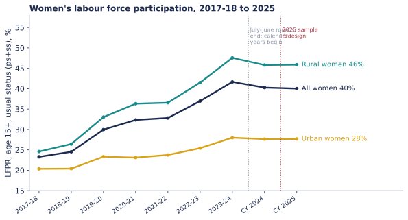
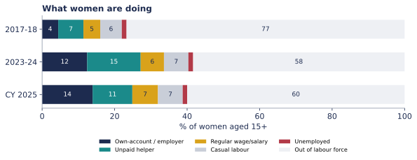
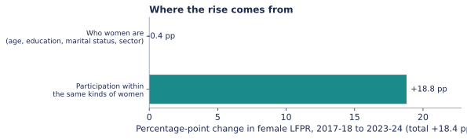

# Where did India's rise in women's work come from?

Analysis of the Periodic Labour Force Survey (PLFS), 2017-18 to 2025. **Draft work sample, not peer reviewed.**
Read the illustrated version: `https://nikhil-gajbhiye.github.io/plfs-female-lfp/`

## Findings

Female labour force participation (age 15+, usual status ps+ss) rose from **23.3%** in 2017-18 to **41.7%** in 2023-24, then read **40.0%** in calendar 2025.

1. **It is not about who women are.** A decomposition by sector, age band, education band and marital status attributes **-0.4 pp** of the **+18.4 pp** rise to changes in composition and **+18.8 pp** to rising participation within the same kinds of women.
2. **Most of the new work is self-employment and unpaid help.** As a share of all women 15+, own-account/employer work rose 4.5% to 12.4% and unpaid helper work 7.0% to 14.8%. Together that is **about 86%** of the rise in female employment. Regular wage work rose 1.8 pp and casual labour 0.8 pp.
3. **2025 is hard to read.** From 2023-24 to CY2025, LFPR fell 1.6 pp and unpaid helper work fell 3.8 pp. The survey moved from July-June rounds to calendar years and the sample was redesigned in January 2025, so this is not yet a clean trend.

## Validation

Weighted estimates reproduce MoSPI's published headline figures (e.g. 2023-24: LFPR 60.1, women 41.7, WPR 58.2; CY2024: 59.6 / 57.7; CY2025: 59.3, women 40.0, WPR 57.4, UR 3.1). Checked against published figures: 2017-18 (LFPR, women's LFPR), 2022-23, 2023-24, CY2024, CY2025. **Not yet checked against reports:** 2018-19 to 2021-22 (`results/headline_indicators.csv`).

## Method

- First-visit person files only. Weights: `mult / no_qtr / (100 if nss == nsc else 200)` for July-June rounds and CY2024; `mult / 100` for CY2025 (each release's README).
- Usual status (ps+ss): a person is a worker if principal or subsidiary status is 11-51; unemployed if principal status is 81/82 with no subsidiary work.
- Kitagawa decomposition over sector x 5 age bands x 4 education bands x married/not.
- 2022-23 contains nine Assam records with a weight of 5.9 million (documented by MoSPI). Women's LFPR is 36.97 with them and 37.98 without; both are reported.

## Limitations

- No standard errors yet. The design's two-sub-sample variance estimator is the next step.
- The decomposition uses coarse cells. A large within-group term shows what did not change (composition), not why participation rose.
- Comparisons across the 2025 redesign are indicative only.
- Weights sum to roughly 1.1-1.2 billion, below India's population (Census 2011 frame, no calibration), so only rates are reported.

## Reproduce

1. Download PLFS unit-level CSV files from the MoSPI microdata portal (`microdata.gov.in`), free registration. The data is **not** in this repo (the access agreement limits use to the applicant).
2. Put the zip files in `data/raw/` (file names are listed in `src/plfs.py`).
3. `pip install -r requirements.txt` then `python run_all.py`. Tables go to `results/`, charts to `docs/img/`.

Source: Periodic Labour Force Survey, National Statistics Office, MoSPI, Government of India. Code: MIT licence.
